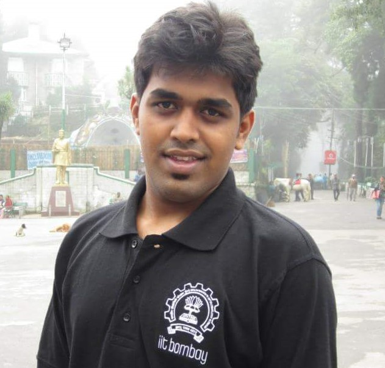
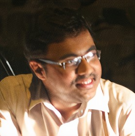

# Faculty-Workshop at RIT: Machine Learning Applications
This repository is for the FDP workshop on Machine Learning Applications organized by RIT, Maharashtra 

## Speakers
- Samrudha Kelkar ( Senior Data Scientist, Spiceworks) 

  Samrudha works on solving NLP, computer vision, ML, and optimization problems as a product data scientist. He has worked in companies like Honeywell, DBS Bank, Spiceworks. He holds a master's degree with a specialization in image processing from IIT, Bombay  

- Sarath S ( Researcher, TRDDC (A research lab of TCS), Pune) 

  Sarath works as a researcher in the computer vision domain. He has an interest in deep learning, Media, Vision, and behavioral sciences. He is associated with the CVIT lab, IIIT Hyderabad as a post-graduate student.

## Presentation:
Presentation for the workshop can be accessed at: https://prezi.com/view/vuIw7tUuSRkheTD4M3iD/
